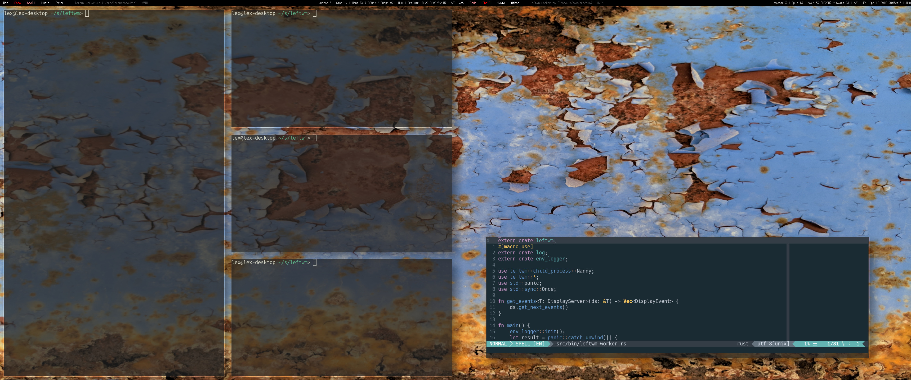

# LeftWM - A window manager for Adventurers


## Why go left 

Left is a tiling window manager written in rust for stability and performance. The core of left is designed to do one thing and one thing well. Be a window manager. Because you probably want more than just a black screen LeftWM is built around the concept of theming. With themes you can choose between different bar / compositor / background / colors, whatever makes you happy.   

LeftWM has been built from the very beginning to support multiple screens and has been built around ultrawide monitors. You will see this with the default key bindings

## Left is NOT

Left is not a compositor.

Left is not a lock screen.

Left is not a bar there are lots of good bars out there. With themes, picking one is as simple as setting a symlink.


## Config
The settings file to change key bindings and the default mod key can be found at
```
~/.config/leftwm/config.toml
```

### Default keys
```
Mod + (1-9) => switch to a desktop/tag
Mod + Shift + (1-9) => move the focused window to desktop/tag
Mod + W => switch the desktops for each screen. Desktops [1][2] changes to [2][1]
Mod + Shift + W => move window to the other desktop
Mod + (⬆️⬇️) => Focus the different windows in the current workspace
Mod + Shift + (⬆️⬇️) => Move the different windows in the current workspace
Mod + Enter => Move selected window to the top of the stack in the current workspace
Mod + Ctrl + (⬆️⬇️) => Switch between different layouts
Mod + Shift + (⬅➡) => Switch between different workspaces
Mod + Shift + Enter => open a terminal
Mod + Ctrl + L => lock the screen
Mod + Shift + X => Exit LeftWM
Mod + Shift + Q => close the current window
Mod + Shift + R => reload LeftWM and its config
```

### Workspaces
By default workspaces have a one to one relationship with screens, but this is configurable. There are many reasons you might want to change this, but the main reason is for ultrawide monitors. You might want to have two or even three workspaces on a single screen. 

Here is an example config changing the way workspaces are defined (~/.config/leftwm/config.toml)
```
[[workspaces]]
y = 0
x = 0
height = 1440
width = 1720

[[workspaces]]
y = 0
x = 1720
height = 1440
width = 1720
```

### Tags / Desktops
The default tags are 1-9. They can be renamed in the config file by setting the
list of tags.

Here is an example config changing the list of available tags. NOTE: tag navigation (Mod + #) doesn't change based on the name of the tag
```
tags = ["Web", "Code", "Shell", "Music", "Connect"]
```


### LeftWM is [EWMH](https://en.wikipedia.org/wiki/Extended_Window_Manager_Hints) compliant.


## One of the core concepts/features of LeftWM is theming 

With left there are two types of configs. First there are config settings that are specific to you but don’t really change. These are settings like keybindings. Workspace locations, and names of desktops/tags. These settings can be found in ~/.config/leftwm/config.toml

The appearance of your desktop is different. It’s fun to try new looks and feels. It’s fun to tweak and customize the appearance ( AKA: ricing ). It’s fun to share so others can experience your cool awesome desktop. LeftWM is built around this concept. By pulling all these settings out into themes, you can now easily tweak, switch, and share your experiences. 

## Setup (with package manager)

LeftWM is available in AUR as well as crates.io. Both are good options for simple installation. Please note, if installing with crates.io you will need to link to the xsession desktop file if you want to be able to login to LeftWM from a graphical login screen. 
```bash
sudo cp PATH_TO_LEFTWM/leftwm.desktop /usr/share/xsessions
```

LeftWM avaialbe in Fedora [Copr](https://copr.fedorainfracloud.org/coprs/atim/leftwm/): `sudo dnf copr enable atim/leftwm -y && sudo dnf install leftwm`

## Manual Setup (no package manager)

### Using a graphical login such as LightDM, GDM, LXDM, and others

1) copy leftwm.desktop to /usr/share/xsessions
2) create a symlink to the build of leftwm so that it is in your path
```bash
cd /usr/bin
sudo ln -s PATH_TO_LEFTWM/target/debug/leftwm
sudo ln -s PATH_TO_LEFTWM/target/debug/leftwm-worker
sudo ln -s PATH_TO_LEFTWM/target/debug/leftwm-state
```
and
```bash
sudo cp PATH_TO_LEFTWM/leftwm.desktop /usr/share/xsessions
```
You should now see LeftWM in your list of available window managers.

### Starting with startx or a login such as slim
make sure this is at the end of your .xinitrc file
```bash .xinitrc
exec dbus-launch leftwm
```

### Themes
If you want to see more than a black screen when you login, select a theme
```bash 
mkdir -p ~/.config/leftwm/themes
cd ~/.config/leftwm/themes
ln -s PATH_TO_THE_THEME_YOU_LIKE current
```
LeftWM comes packaged with a couple default plain themes. There is also a [community repository for sharing themes](https://github.com/leftwm/leftwm-community-themes)

For more information about themes checkout our theme guide [here](https://github.com/leftwm/leftwm/tree/master/themes).

### Dependencies 
While LeftWM has very few dependencies this isn't always the case for themes.
Themes typically require the following to be installed. But this is up to the
author of the theme and could be different. 
List of common dependencies for Themes: 
- feh 
- compton or picom
- dmenu
- (Some kind of bar, different for each theme)
    - polybar 
    - xmobar 
    - lemonbar 
    - conky 


| Build Dependency | ubuntu20.4.1              |
| ---------------- | ------------------------- |
| feh              | sudo apt install feh      |
| compton          | sudo apt install compton  |
| picom            | manual                    |
| polybar          | munual                    |
| xmobar           | sudo apt install xmobar   |
| lemonbar         | sudo apt install lemonbar |
| conky            | sudo apt install conky    |
| dmenu            | sudo apt install dmenu    |
