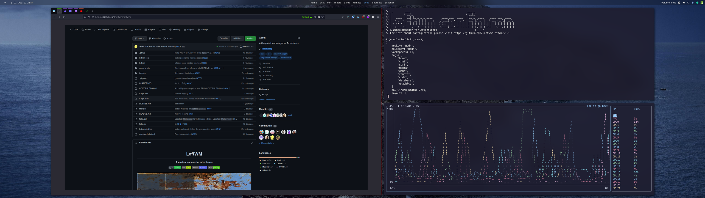

<div align="center">
  <h1><strong>LeftWM</strong></h1>
  <p>
	<strong>A window manager for adventurers</strong>
  </p>
  <p>
	<a href="https://github.com/leftwm/leftwm/actions?query=workflow%3ACI">
		
	</a>
	<a href="https://github.com/leftwm/leftwm/wiki">
		
	</a>
	<a href="https://docs.rs/leftwm/">
		
	</a><br />
	<a href="https://discord.gg/c9rB3wDnVs">
		
	</a>
	<a href="https://matrix.to/#/#leftwm-announcements:matrix.org">
		
	</a>
	</a>
	<a href="https://matrix.to/#/#leftwm-general:matrix.org">
			
	</a>
	</a>
	<a href="https://matrix.to/#/#leftwm-support:matrix.org">
			
	</a>
  </p>
</div>



**IMPORTANT NOTE: LeftWM has changed the config language from `TOML` to `RON` with the `0.4.0` release. Please use `leftwm-check --migrate-toml-to-ron` to migrate your config and visit the [wiki](https://github.com/leftwm/leftwm/wiki) for more info.**

# Table of contents

- [Why go left](#why-go-left)
- [Dependencies](#dependencies)
- [Installation (with package manager)](#installation-with-package-manager)
- [Manual Installation (no package manager)](#manual-installation-no-package-manager)
  - [Using a graphical login such as LightDM, GDM, LXDM, and others](#using-a-graphical-login-such-as-lightdm-gdm-lxdm-and-others)
  - [Optional Development Installation](#optional-development-installation)
  - [Optional Build Features](#optional-build-features)
  - [Using the Makefile](#using-the-makefile)
  - [Starting with startx or a login such as slim](#starting-with-startx-or-a-login-such-as-slim)
- [Theming](#theming)
  - [With LeftWM-Theme](#with-leftwm-theme)
  - [Without LeftWM-Theme](#without-leftwm-theme)
- [Configuring](#configuring)
  - [Default keys](#default-keys)
  - [Floating Windows](#floating-windows)
  - [Workspaces](#workspaces)
  - [Tags / Desktops](#tags--desktops)
  - [Layouts](#layouts)
- [Troubleshooting](#troubleshooting)
- [Support](#support)

# Why go left

LeftWM is a tiling window manager written in [Rust] that aims to be stable and performant. LeftWM is
[designed to do one thing and to do that one thing well][unix-philosophy]: _be a window manager_.
LeftWM follows the following mantra:

> LeftWM is not a compositor.
> LeftWM is not a lock screen.
> LeftWM is not a bar. But, there are lots of good bars out there. With themes, picking one is as
> simple as setting a symlink.

Because you probably want more than just a black screen, LeftWM is built around the concept of
themes. With themes, you can choose between different bars, compositors, backgrounds, colors, docks,
and whatever else makes you happy.

LeftWM was built from the very beginning to support multiple screens and ultrawide monitors. The
default keybindings support ultrawide monitors and multiple screens.

[Rust]: https://github.com/rust-lang/rust
[unix-philosophy]: https://en.wikipedia.org/wiki/Unix_philosophy#Do_One_Thing_and_Do_It_Well

## One of the core concepts/features of LeftWM is theming

With LeftWM, there are two types of configuration files:

- **LeftWM Configuration files:** LeftWM configurations are specific to you and don’t change for
  different themes. These are settings like keybindings, workspace locations, and names of
  desktops/tags. These settings can be found in `$XDG_CONFIG_HOME/leftwm/config.ron`.

- **Theme Configuration files:** The appearance of your desktop is different. It’s fun to try new
  looks and feels. It’s fun to tweak and customize the appearance (AKA: [ricing]). It’s fun to share
  so others can experience your awesome desktop! LeftWM is built around this concept. By pulling all
  these settings out into themes, you can now easily tweak, switch, and share your experiences. This
  configuration is spread between `theme.ron` and related files contained within a theme's folder.

**Note:** some example config and themes can be found in the share dir, e.g. `/usr/share/leftwm` oh Arch based disros.

[ricing]: https://www.reddit.com/r/unixporn/comments/3iy3wd/stupid_question_what_is_ricing/

# Dependencies

While LeftWM has very few dependencies, this isn't always the case for themes.
Themes typically require the following to be installed. However, this is up to the
author of the theme and could be different.

List of LeftWM dependencies:

- xorg (runtime, build): specifically libx11, xrandr, xorg-server, libxinerama
- sh (runtime): any posix-compliant shell for starting up and down files
- rust (build): >= 1.74.0
- bash (optional): Most of the themes available use bash, though the scripts maybe converted to any posix-compliant shell

List of common dependencies for themes:

| Dependency<br>(git)      | Ubuntu 20.4.1<br> _sudo apt install {}_ | Arch<br> _sudo pacman -S {}_ | Fedora 33<br> _sudo dnf install {}_ | PKGS                     |
| ------------------------ | --------------------------------------- | ---------------------------- | ----------------------------------- | ------------------------ |
| [feh][feh-git]           | feh                                     | feh                          | feh                                 | [feh][feh-pkg]           |
| [compton][compton-git]   | compton                                 | picom                        | compton                             | [compton][compton-pkg]   |
| [picom][picom-git]       | manual \*\*                             | picom                        | picom                               | [picom][picom-pkg]       |
| [polybar][polybar-git]   | manual \*\*                             | polybar                      | polybar                             | [polybar][polybar-pkg]   |
| [xmobar][xmobar-git]     | xmobar                                  | xmobar                       | xmobar                              | [xmobar][xmobar-pkg]     |
| [lemonbar][lemonbar-git] | lemonbar                                | paru -S lemonbar\*           | manual \*\*                         | [lemonbar][lemonbar-pkg] |
| [conky][conky-git]       | conky                                   | conky                        | conky                               | [conky][conky-pkg]       |
| [dmenu][dmenu-git]       | dmenu                                   | dmenu                        | dmenu                               | [dmenu][dmenu-pkg]       |

[feh-git]: https://github.com/derf/feh
[feh-pkg]: https://pkgs.org/search/?q=feh&on=provides
[compton-git]: https://github.com/chjj/compton
[compton-pkg]: https://pkgs.org/download/compton
[picom-git]: https://github.com/yshui/picom
[picom-pkg]: https://pkgs.org/download/picom
[polybar-git]: https://github.com/polybar/polybar
[polybar-pkg]: https://pkgs.org/download/polybar
[xmobar-git]: https://github.com/jaor/xmobar
[xmobar-pkg]: https://pkgs.org/download/xmobar
[lemonbar-git]: https://github.com/LemonBoy/bar
[lemonbar-pkg]: https://pkgs.org/download/lemonbar
[conky-git]: https://github.com/brndnmtthws/conky
[conky-pkg]: https://pkgs.org/download/conky
[dmenu-git]: https://git.suckless.org/dmenu
[dmenu-pkg]: https://pkgs.org/download/dmenu

> \* You can use whichever AUR wrapper you like. See [paru] and [yay].
> \*\* See the git page (link in first column) for how to install these manually

# Installation (with package manager)

[](https://repology.org/project/leftwm/versions)

## Gentoo ([GURU])

```sh
sudo layman -a guru && sudo emerge --sync
sudo emerge --ask --verbose x11-wm/leftwm
```

## Archlinux ([AUR])

```sh
paru -S leftwm
```

[paru] is an AUR helper like [yay], but written in [Rust].

## Fedora ([copr])

```sh
sudo dnf copr enable th3-s4lm0n/leftwm -y && sudo dnf install leftwm
```

## NetBSD ([Official repositories])

```sh
pkgin install leftwm
```

or, if you prefer to build it from source

```sh
cd /usr/pkgsrc/wm/leftwm
make install
```

## Void ([XBPS])

```sh
sudo xbps-install -S leftwm
```

## Cargo ([crates.io])

```sh
cargo install leftwm
```

If you install LeftWM with crates.io, you will need to link to the [xsession desktop file](https://github.com/leftwm/leftwm/blob/758bbf837a8556cdc7e09ff2d394f528e7657333/leftwm.desktop) if you want
to be able to login to LeftWM from a display manager (GDM, SSDM, LightDM, etc.):

```sh
sudo cp PATH_TO_LEFTWM/leftwm.desktop /usr/share/xsessions
```

Also see [the build options](#optional-build-features) for more feature options, especially if you don't use `systemd` or want to use your own hotkey daemon like `sxhkd`.

## OpenBSD ([OpenBSD])

At the moment LeftWM is not packaged with OpenBSD package manager, but it could be installed via Cargo.

```sh
cargo install leftwm --no-default-features --features lefthk
```

`leftwm-config` not yet ported to OpenBSD, as it requires a nightly Rust compiler to build.
The default config is generated by LeftWM when it is first started.

To start LeftWM with `xenodm` add the following to your `~/.xsession`. Make sure to remove or comment-out the `exec` to the previous WM you had there.

```sh
exec dbus-launch ~/.cargo/bin/leftwm >> ~/.cache/leftwm.log 2>&1
```

[AUR]: https://aur.archlinux.org/packages/leftwm
[GURU]: https://gitweb.gentoo.org/repo/proj/guru.git/tree/x11-wm/leftwm
[copr]: https://copr.fedorainfracloud.org/coprs/atim/leftwm/
[Official repositories]: https://pkgsrc.se/wm/leftwm/
[XBPS]: https://voidlinux.org/packages/?arch=x86_64&q=leftwm
[crates.io]: https://crates.io/crates/leftwm
[paru]: https://github.com/Morganamilo/paru
[yay]: https://github.com/Jguer/yay
[OpenBSD]: https://openbsd.org

# Manual Installation (no package manager)

## Using a graphical login such as LightDM, GDM, LXDM, and others

1. Dependencies: Rust, Cargo
2. Clone the repository and cd into the directory

   ```bash
   git clone https://github.com/leftwm/leftwm.git
   cd leftwm
   ```

3. Build leftwm

   ```bash
   cargo build --profile optimized
   ```

   For more options see the [build options](#optional-build-features) section.

4. Copy leftwm executables to the /usr/bin folder

   ```bash
   sudo install -s -Dm755 ./target/optimized/leftwm ./target/optimized/leftwm-worker ./target/optimized/lefthk-worker ./target/optimized/leftwm-state ./target/optimized/leftwm-check ./target/optimized/leftwm-command -t /usr/bin
   ```

5. Copy leftwm.desktop to xsessions folder

   ```bash
   sudo cp leftwm.desktop /usr/share/xsessions/
   ```

You should now see LeftWM in your list of available window managers. At this point, expect only a
simple black screen on login. For a more customized look, install a theme.

## Optional Development Installation

If your goal is to continuously build leftwm and keep up to date with the latest releases, you may
prefer to symlink the leftwm executables instead of copying them. If you choose to install this
way, make sure you do not move the build directory as it will break your installation.

Note that if you want to build leftwm with another build profile, you will have to change the
`--profile <profile-name>` option and the target folder to `target/<profile-name>`.
Currently available are `dev`, `release` and `optimized`.

1. Dependencies: Rust, Cargo
2. Clone the repository and cd into the directory

   ```bash
   git clone https://github.com/leftwm/leftwm.git
   cd leftwm
   ```

3. Build leftwm

   ```bash
   # With systemd logging (view with 'journalctl -f -t leftwm-worker')
   cargo build --profile optimized
   ```

   For more options see [build options below](#optional-build-features).

4. Create the symlinks

   ```bash
   sudo ln -s "$(pwd)"/target/optimized/leftwm /usr/bin/leftwm
   sudo ln -s "$(pwd)"/target/optimized/leftwm-worker /usr/bin/leftwm-worker
   sudo ln -s "$(pwd)"/target/optimized/lefthk-worker /usr/bin/lefthk-worker
   sudo ln -s "$(pwd)"/target/optimized/leftwm-state /usr/bin/leftwm-state
   sudo ln -s "$(pwd)"/target/optimized/leftwm-check /usr/bin/leftwm-check
   sudo ln -s "$(pwd)"/target/optimized/leftwm-command /usr/bin/leftwm-command
   ```

5. Copy leftwm.desktop to xsessions folder

   ```bash
   sudo cp leftwm.desktop /usr/share/xsessions/
   ```

You should now see LeftWM in your list of available window managers. At this point, expect only a
simple black screen on login. For a more customized look, install a theme.

### Rebuilding the development installation

1. Now if you want to get the newest version of leftwm run this command from your build directory:

   ```bash
   git pull origin main
   ```

2. Build leftwm

   ```bash
   # With systemd logging (view with 'journalctl -f -t leftwm-worker')
   cargo build --profile optimized
   ```

3. And press the following keybind to reload leftwm

   ```bash
   Mod + Shift + R
   ```

### Optional Build Features

Since `LeftWM` is targeting to be more and more modular, there are a few features that can be selected at compile time:

Use `cargo` with the added flags `--no-default-features --features=` and then commaseparated a selection from the following features:

| feature      | info                                                                                                                                                                                           | default |
| ------------ | ---------------------------------------------------------------------------------------------------------------------------------------------------------------------------------------------- | ------- |
| lefthk       | built-in hotkey daemon, if you build with out make sure you bring your own (e.g. `sxhkd`) to manage any keybinds, be sure you install the `lefthk-worker` binary if you build with this option | ✔      |
| journald-log | logging to `journald`, depends on `systemd`                                                                                                                                                    | ✔      |
| sys-log      | use standard system logging                                                                                                                                                                    | ✘       |
| file-log     | log to `/tmp/leftwm/<log-file-by-datetime-of-launch>`                                                                                                                                          | ✘       |
| xlib (\*)    | legacy backend linking to `libX11`                                                                                                                                                             | ✔       |
| x11rb (\*)   | rust based backend using [`x11rb`](https://github.com/psychon/x11rb)                                                                                                                           | ✔       |

⚠️ You need to select **at least one** backend feature (\*) for leftwm to build ⚠️

Example:

```bash
# With `lefthk` and logging to `sys-log` (`x11rb` backend)
cargo build --profile optimized --no-default-features --features=x11rb,lefthk,sys-log

# Without `lefthk` and logging to file (`xlib` backend)
cargo build --profile optimized --no-default-features --features=xlib,file-log
```

There are also multiple levels of optimization. These are specified by the cargo profiles, available are `dev`, `release` and `optimized`. The dev and release profiles are default profiles used by cargo, whereas the optimized profile is recomended for production builds.

Example:

```bash
# With the dev profile
cargo build --profile dev

# With the release profile
cargo build --profile release
```

## Using the Makefile

For conveniece we also have a Makefile with the following rules:

| make ...       | info                                                                                                                         |
| -------------- | ---------------------------------------------------------------------------------------------------------------------------- |
| all            | implies `build` and `test`                                                                                                   |
| test           | runs same tests as CI on github                                                                                              |
| test-full      | deprecated, do not use                                                                                                       |
| test-full-nix  | same as `test-full` but additionally compiles the nix package, resulting in a full representation of ci checks               |
| build          | builds with cargo profile `optimized` by default; read build output on how to change the profile.                            |
| clean          | clean all buildfiles                                                                                                         |
| install        | install by copying binaries to `/usr/bin`, also places `leftwm.desktop` file to `/usr/share/xsession` and cleans build files |
| install-linked | installs by symlinking, copies `leftwm.desktop`, no clean                                                                    |
| uninstall      | removes `leftwm-*` files from `/usr/bin` and `leftwm.desktop` file                                                           |

Note that for `build`, `install` and `install-linked`, you can specify the build profile to use by adding the `profile=<profile-name>` argument. Currently available are `dev`, `release` and `release-optimized`.

## Starting with startx or a login such as slim

Make sure this is at the end of your `.xinitrc` file:

```bash
# .xinitrc
exec dbus-launch leftwm
```

On some distros like Archlinux, the environment variables are being setup by sourcing `/etc/X11/xinit/xinitrc.d`, as described in [the Arch docs](https://wiki.archlinux.org/title/Xinit#xinitrc), please make sure you copy the default xinitrc like this:

```bash
cp /etc/X11/xinit/xinitrc ~/.xinitrc
```

**Note:** In this case it is not necessary to start leftwm through `dbus-launch` and might even result in some cases in services like `gnome-keyring` to fail. In such an occasion just use:

```bash
# .xinitrc
exec leftwm
```

# Theming

If you want to see more than a black screen when you login, select a theme:

## With [LeftWM-Theme](https://github.com/leftwm/leftwm-theme)

```bash
leftwm-theme update
leftwm-theme install NAME_OF_THEME_YOU_LIKE
leftwm-theme apply NAME_OF_THEME_YOU_LIKE
```

## Without [LeftWM-Theme](https://github.com/leftwm/leftwm-theme)

To set up your own custom theme, you will need to create a directory containing the theme files and then symlink it to `$XDG_CONFIG_HOME/leftwm/themes/current`.

A theme directory contains at least 2 files:

- `up`: a script which is loaded with the theme.
- `down`: a script which is called when the theme is unloaded.

These files need to be made executable. Many theme directories also contain:

- `theme.ron`: which contains additional configuration options specific to the theme.
- `polybar.ini`: a configuration file for the `polybar` application. _You need to have polybar installed!_
- `picom.conf`: a configuration file for the `picom` compositor. _You need to have picom installed!_

See the [theme guide][theme-guide] for examples and further information. There is also a
[community repository][community-repo] for sharing themes.

[community-repo]: https://github.com/leftwm/leftwm-community-themes
[theme-guide]: /themes

---

# Configuring

You can configure key bindings, default mod key and many other options:

## With [LeftWM-Config](https://github.com/leftwm/leftwm-config)

```bash
leftwm-config -n # Generate new config
leftwm-config    # Open configuration file in $EDITOR
leftwm-config -t # Edit configuration via TUI (Beta)
```

## Manually editing the configuration file

```bash
$XDG_CONFIG_HOME/leftwm/config.ron
```

---

**Note:** The configuration file is automatically generated when leftwm or leftwm-check is run for the first time.

---

## Default keys

| Keybinding           | Description                                                            |
| -------------------- | ---------------------------------------------------------------------- |
| Mod + (1-9)          | Switch to a desktop/tag                                                |
| Mod + Shift + (1-9)  | Move the focused window to desktop/tag                                 |
| Mod + W              | Switch the desktops for each screen. Desktops [1][2] changes to [2][1] |
| Mod + Shift + W      | Move window to the other desktop                                       |
| Mod + (⬆️⬇️)         | Focus on the different windows in the current workspace                |
| Mod + Shift + (⬆️⬇️) | Move the different windows in the current workspace                    |
| Mod + Enter          | Move selected window to the top of the stack in the current workspace  |
| Mod + Ctrl + (⬆️⬇️)  | Switch between different layouts                                       |
| Mod + Shift + (⬅➡) | Switch between different workspaces                                    |
| Mod + Shift + Enter  | Open a terminal                                                        |
| Mod + Ctrl + L       | Lock the screen                                                        |
| Mod + Shift + X      | Exit LeftWM                                                            |
| Mod + Shift + Q      | Close the current window                                               |
| Mod + Shift + R      | Reload LeftWM and its config                                           |
| Mod + p              | Use dmenu to start application                                         |

**Note:** Although we encourage you to use [Alacritty](https://github.com/alacritty/alacritty),
LeftWM will set your default terminal to the first terminal it finds in this list (in the order
presented):

1. Alacritty
2. Termite
3. Kitty
4. URXVT
5. RXVT
6. ST
7. ROXTerm
8. Eterm
9. XTerm
10. Terminator
11. Terminology
12. Gnome Terminal
13. XFCE4 Terminal
14. Konsole
15. UXTerm
16. Guake

## Floating Windows

You can optionally switch between tiling or floating mode for any window.

| Keybinding              | Description                             |
| ----------------------- | --------------------------------------- |
| Mod + MouseDrag         | Switch a tiled window to floating mode  |
| Mod + RightMouseDrag    | Resize a window                         |
| Drag window onto a tile | Switch a floating window to tiling mode |
| Mod + Shift + (1-9)     | Switch a floating window to tiling mode |

## Workspaces

Workspaces are how you view tags (desktops). A workspace is an area on a screen or most likely the whole screen. in these areas you can view a given tag.

Default: `workspaces: []` (one workspace per screen)

Workspaces are only applied if the specified output is the name of a connected screen. The output is also used as identifier of the workspace.

You can get the output names by running xrandr in your terminal.

Example (two workspaces on a single ultrawide):

```rust
workspaces: [
	( output: "HDMI-1", y: 0, x: 0, height: 1440, width: 1720 ),
	( output: "HDMI-1", y: 0, x: 1720, height: 1440, width: 1720 ),
],
```

## Tags / Desktops

The default tags are 1-9. They can be renamed in the config file by setting the
list of tags.

Here is an example config changing the list of available tags. NOTE: tag navigation (Mod + #)
is based on the index of the tag in the list (starting with index 1).

```rust
tags: ["Web", "Code", "Shell", "Music", "Connect"],
```

## Layouts

Leftwm supports user definable layouts. The relevant entries in the configuration file are the `layouts` and `layout_definitions` lists.

Only the layouts whose name appears in `layouts` will be accessible when switching layouts through the commands `NextLayout`, `PreviousLayout` and `SetLayout`. Each layout appearing in the `layouts` list must have a corresponding definition in `layout_definitions`.

Example:

```rust
layouts: [
	"Monocle",
	"MainAndDeck",
	"MainAndVertStack",
],
layout_definitions: [
	(name: "Monocle", flip: None, rotate: North, reserve: None, columns: (flip: None, rotate: North, main: None, stack: (flip: None, rotate: North, split: None), second_stack: None)),
	(name: "MainAndDeck", flip: None, rotate: North, reserve: None, columns: (flip: None, rotate: North, main: (count: 1, size: 0.5, flip: None, rotate: North, split: None), stack: (flip: None, rotate: North, split: None), second_stack: None)),
	(name: "MainAndVertStack", flip: None, rotate: North, reserve: None, columns: (flip: None, rotate: North, main: (count: 1, size: 0.5, flip: None, rotate: North, split: Vertical), stack: (flip: None, rotate: North, split: Horizontal), second_stack: None)),
]
```

[More detailed configuration information can be found in the Wiki.][config-wiki]

[config-wiki]: https://github.com/leftwm/leftwm/wiki/Config

## LeftWM is [EWMH](https://en.wikipedia.org/wiki/Extended_Window_Manager_Hints) compliant

The default layouts are [all of the kinds defined here](https://github.com/leftwm/leftwm-layouts/blob/main/leftwm-layouts/src/layouts/defaults.rs).

## Troubleshooting

| Issue                              | Description                                                                                                             |                        Solution                        |
| ---------------------------------- | ----------------------------------------------------------------------------------------------------------------------- | :----------------------------------------------------: |
| LeftWM not listed by login manager | You likely need to add the xsessions file to the right folder.                                                          | See [installation](#installation-with-package-manager) |
| No `config.ron` file exists        | LeftWM does not always ship with a `config.ron`. You will need to execute LeftWM at least once for one to be generated. |           Try the following: `leftwm-worker`           |
| `config.ron` is not being parsed   | LeftWM ships with a binary called leftwm-check. It might not be installed by the AUR.                                   |           Try the following: `leftwm-check`            |
| Keybinding doesn't work            | It's likely you need to specify a value or have a typo.                                                                 |                        See Wiki                        |

## Support

LeftWM now has a [Discord](https://discord.gg/c9rB3wDnVs) channel for faster help.
